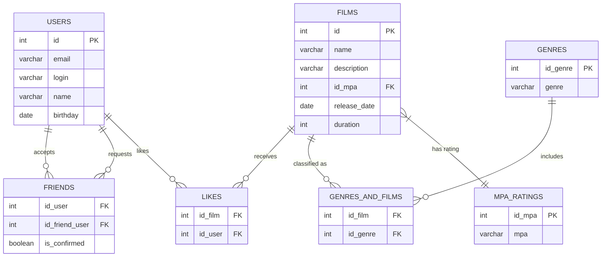

# ER-диаграмма Filmorate

Схема базы данных приложения для хранения информации о фильмах, оценках пользователей и дружбе.

## 🗺 Визуализация схемы (ER-диаграмма)



## 🗄 Примеры SQL запросов

### 1. Получение топ-10 популярных фильмов
Возвращает 10 фильмов с наибольшим количеством лайков. Если лайков одинаково — порядок не определен.

```sql
SELECT f.name, 
       COUNT(l.id_user) AS likes_count
FROM films AS f
LEFT JOIN likes AS l ON l.id_film = f.id
GROUP BY f.id
ORDER BY likes_count DESC
LIMIT 10;
```

### 2. Получение общих друзей
Находит пересечение списков друзей для пользователя с `id=1` и пользователя с `id=2`. Учитываются только подтвержденные записи дружбы.

```sql
SELECT u.name, u.email
FROM friends AS f1
JOIN friends AS f2 ON f1.id_friend_user = f2.id_friend_user
JOIN users AS u ON u.id = f1.id_friend_user
WHERE f1.id_user = 1 
  AND f2.id_user = 2
  AND f1.is_confirmed = true 
  AND f2.is_confirmed = true;
```

## 📝 Описание схемы (DBML)

<details>
<summary>Развернуть исходный код DBML</summary>

```
Table users {
  id integer [primary key]
  name varchar
  email varchar
  login varchar
  birthday date
}

Table films {
  id integer [primary key]
  name varchar
  description varchar
  id_mpa integer
  release_date date
  duration integer
}

Table likes {
  id_film integer
  id_user integer
  indexes {
    (id_film, id_user) [pk]
  }
}

Table genres {
  id_genre integer [primary key]
  genre varchar
}

Table genres_and_films {
  id_film integer
  id_genre integer
  indexes {
    (id_film, id_genre) [pk]
  }
}

Table mpas {
  id_mpa integer [primary key]
  mpa varchar
}

Table friends {
  id_user integer
  id_friend_user integer
  is_confirmed boolean
  indexes {
    (id_user, id_friend_user) [pk]
  }
}

Ref: "users"."id" < "likes"."id_user"
Ref: "films"."id" < "likes"."id_film"
Ref: "films"."id" < "genres_and_films"."id_film"
Ref: "genres"."id_genre" < "genres_and_films"."id_genre"
Ref: "users"."id" < "friends"."id_user"
Ref: "users"."id" < "friends"."id_friend_user"
Ref: "mpas"."id_mpa" < "films"."id_mpa"
