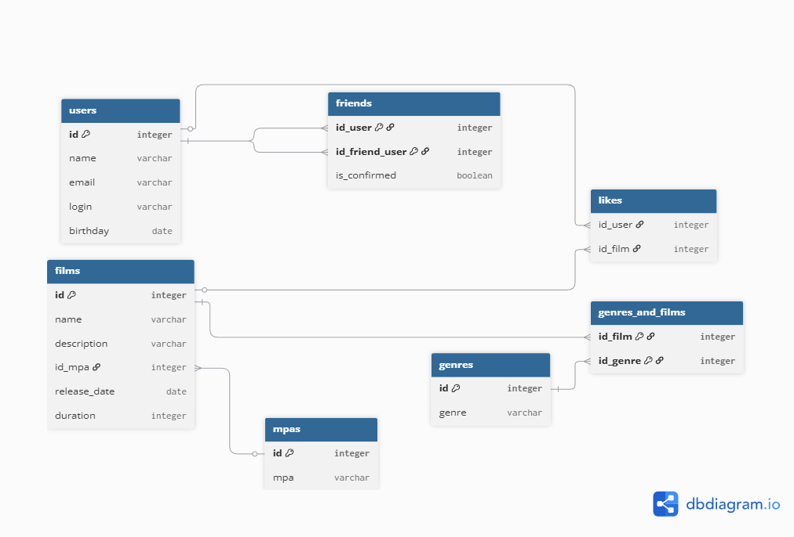

# 🎬 Проект Filmorate
## 🗺 Визуализация схемы базы данных (ER-диаграмма)
Схема базы данных приложения для хранения информации о фильмах, оценках пользователей и дружбе.

## 🗄 Endpoints
### 🎥 Фильмы (Films)

#### 1. Получение всех фильмов
Возвращает список всех фильмов, сохраненных в базе.

* **URL:** `/films`
* **Method:** `GET`
* **Success Code:** `200 OK`

**Пример ответа:**
<details>
  <summary>📄 Пример JSON (Нажми, чтобы развернуть)</summary>
    
```json
[
    {
        "id": 1,
        "duration": 174,
        "name": "jBoPOay2JErVS3C",
        "description": "x70YrDBMkm8nJHhktTqHXMxGZUn6EPHthlqcxGvEo8o3uS7LVf",
        "genres": [
            {
                "id": 6,
                "genre": "Боевик"
            }
        ],
        "releaseDate": "2004-09-04",
        "mpa": {
            "id": 1,
            "mpaName": "G"
        }
    },
    {
        "id": 2,
        "duration": 178,
        "name": "qUyeb0m2zzuczAb",
        "description": "syEE7XaQ6TBPTy2kl0R1P6AAXFi46RkUX8xu4V9qmA0yeTpgHb",
        "genres": [
            {
                "id": 3,
                "genre": "Мультфильм"
            },
            {
                "id": 5,
                "genre": "Документальный"
            }
        ],
        "releaseDate": "1991-04-24",
        "mpa": {
            "id": 2,
            "mpaName": "PG"
        }
    }
]
```
</details>

### ОБНОВЛЯЕТСЯ

## 📝 Описание схемы (DBML)
<details>
<summary>Развернуть исходный код DBML</summary>

```
// Пользователи
Table users {
  id integer [primary key, increment]
  name varchar
  email varchar
  login varchar
  birthday date
}

// Рейтинги (MPA)
Table mpas {
  id integer [primary key, increment]
  mpa varchar [unique]
}

// Жанры
Table genres {
  id integer [primary key, increment]
  genre varchar [unique]
}

// Фильмы
Table films {
  id integer [primary key, increment]
  name varchar
  description varchar
  id_mpa integer
  release_date date
  duration integer
}

// Таблица Дружбы (связь пользователя с пользователем)
Table friends {
  id_user integer
  id_friend_user integer
  is_confirmed boolean
  
  indexes {
    (id_user, id_friend_user) [pk]
  }
}

// Лайки фильмов
Table likes {
  id_user integer
  id_film integer
}

// Связь фильмов и жанров
Table genres_and_films {
  id_film integer
  id_genre integer
  
  indexes {
    (id_film, id_genre) [pk]
  }
}

// --- СВЯЗИ (Ref) ---

// У фильма один рейтинг MPA
Ref: films.id_mpa > mpas.id

// Связи для Друзей (оба поля ссылаются на users)
Ref: friends.id_user > users.id [delete: cascade]
Ref: friends.id_friend_user > users.id [delete: cascade]

// Связи для Лайков
Ref: likes.id_film > films.id [delete: cascade]
Ref: likes.id_user > users.id [delete: cascade]

// Связи для Жанров фильмов
Ref: genres_and_films.id_film > films.id [delete: cascade]
Ref: genres_and_films.id_genre > genres.id [delete: cascade]
